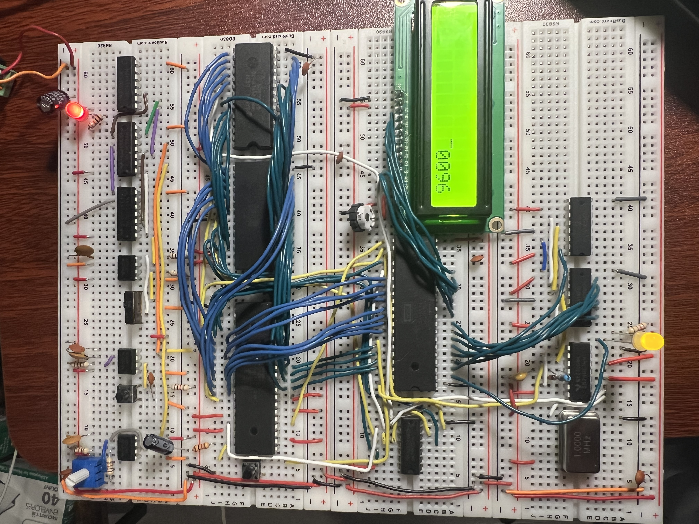

# Hardware Timer Demo ⏰

> **Real-time multitasking on a 6502!** Watch as your breadboard computer juggles LED blinking and LCD updates using hardware interrupts.



## 🎯 What It Does

This project demonstrates **true multitasking** on your 6502 breadboard computer using the W65C22 VIA's hardware timer. The system runs two independent tasks simultaneously:

- **LED Task**: Blinks an LED every 250ms (4 times per second)
- **LCD Task**: Updates the display every 1 second with the current tick count

All powered by a single hardware timer interrupt that fires every 10ms!

## 🔧 How It Works

### The Magic: Hardware Timer Interrupts

The W65C22 VIA chip has two 16-bit timers that can generate interrupts. We configure Timer 1 to:
- Run in free-run mode (automatically reloads)
- Generate an interrupt every ~10ms
- Increment a 4-byte tick counter

```assembly
; Configure VIA Timer 1 for periodic interrupts
init_timer:
  lda #%01000000      ; Timer 1 free-run mode (ACR bit 6)
  sta ACR
  lda #$0e
  sta T1CL            ; Timer 1 low byte
  lda #$27
  sta T1CH            ; Timer 1 high byte
  lda #%11000000      ; Enable Timer 1 interrupt
  sta IER
  cli                 ; Enable interrupts globally
```

### The Interrupt Handler

Every 10ms, this routine runs automatically:

```assembly
irq:
  bit T1CL            ; Acknowledge interrupt
  inc ticks           ; Increment 4-byte counter
  bne end_irq
  inc ticks + 1
  bne end_irq
  inc ticks + 2
  bne end_irq
  inc ticks + 3
end_irq:
  rti
```

### Main Loop: Cooperative Multitasking

The main loop checks if it's time to update each task:

```assembly
loop:
  jsr update_led      ; Check if 250ms elapsed
  jsr update_lcd      ; Check if 1 second elapsed
  jmp loop
```

### LED Update Logic

```assembly
update_led:
  sec
  lda ticks
  sbc toggle_time
  cmp #25             ; 25 ticks = 250ms (25 × 10ms)
  bcc exit_update_led
  lda #$01
  eor PORTA           ; Toggle LED on Port A, bit 0
  sta PORTA
  lda ticks
  sta toggle_time     ; Update last toggle time
```

### LCD Update with Number Conversion

The LCD displays the tick count converted to decimal using our modular conversion library:

```assembly
update_lcd:
  sec
  lda ticks
  sbc lcd_time
  cmp #100            ; 100 ticks = 1 second
  bcc exit_update_lcd
  lda ticks
  sta lcd_time
  
  jsr lcd_home
  lda ticks           ; Low byte
  ldx ticks + 1       ; High byte
  jsr lcd_print_num   ; Convert and display
```

## 🎨 The Modular Architecture

This project showcases our reusable library approach:

### Conversion Library (`lib/conversions.s`)
```assembly
; Convert 16-bit binary to ASCII decimal
; Input:  A = low byte, X = high byte
; Output: b2d_message contains null-terminated string
b2d_convert:
  sta b2d_value
  stx b2d_value + 1
  ; ... conversion logic ...
```

### Enhanced LCD Library (`lib/lcd.s`)
```assembly
; Print a 16-bit number to LCD
; Input:  A = low byte, X = high byte
lcd_print_num:
  jsr b2d_convert     ; Convert to ASCII
  ; ... print the string ...
```

## 🚀 Key Features

- **True Multitasking**: Two independent tasks running simultaneously
- **Hardware-Driven**: Uses VIA timer interrupts for precise timing
- **Modular Design**: Reusable conversion and LCD libraries
- **Real-time Display**: Shows actual tick count updating every second
- **Visual Feedback**: LED blinking provides immediate visual confirmation

## 🎓 What You'll Learn

- **Hardware Timer Programming**: Configuring and using VIA timers
- **Interrupt Handling**: Writing interrupt service routines
- **Multitasking Concepts**: Time-sliced cooperative multitasking
- **Modular Assembly**: Building reusable library components
- **Real-time Systems**: Precise timing without busy-waiting

## 🔍 Technical Details

- **Timer Frequency**: ~10ms intervals (adjustable via T1CL/T1CH)
- **LED Blink Rate**: 250ms (25 timer ticks)
- **LCD Update Rate**: 1 second (100 timer ticks)
- **Counter Size**: 4-byte tick counter (supports ~497 days of uptime!)
- **Memory Usage**: ~128 bytes of code + 16 bytes of data

## 🎉 The Result

When you run this on your breadboard computer, you'll see:
- An LED blinking steadily every 250ms
- The LCD displaying a number that increments every second
- Both happening simultaneously, proving your 6502 can multitask!

This is a perfect example of how hardware interrupts enable sophisticated behavior on simple 8-bit systems. The 6502 may be basic, but with the right hardware support, it can do amazing things!

---

*"Time is what we want most, but what we use worst." - William Penn*

*But not on our 6502! ⏰* 