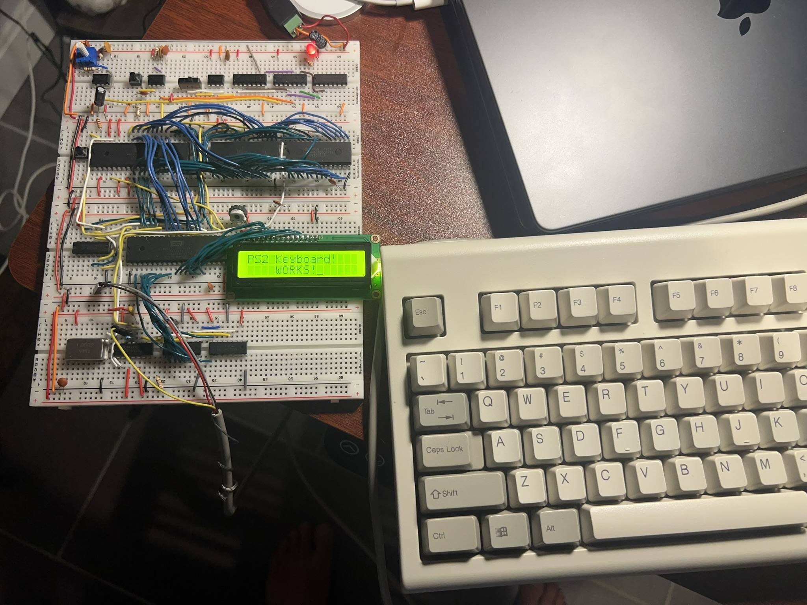

# PS/2 Keyboard Demo ⌨️

> **Type like it's 1981!** Connect a real PS/2 keyboard to your 6502 and watch as every keystroke comes to life on the LCD.



## 🎯 What It Does

This project transforms your breadboard 6502 into a **real computer** by adding PS/2 keyboard support! You can:

- **Type characters** and see them appear on the LCD
- **View raw scancodes** in hexadecimal for debugging
- **Toggle between display modes** (character vs hex) with F1
- **Handle special keys** like Enter, Escape, and Backspace
- **Support Shift key** for uppercase and symbols

All using interrupt-driven PS/2 protocol handling!

## 🔧 How It Works

### The PS/2 Protocol Magic

PS/2 keyboards send data serially on a single wire, with each key generating a **scancode**. Our 6502 reads this via the VIA's interrupt system:

```assembly
; Configure VIA for keyboard interrupt
keyboard_interrupt:
  pha
  txa
  pha
  lda kb_flags
  and #RELEASE   ; Check if we're releasing a key
  beq read_key   ; Otherwise, read the key
```

### Circular Buffer System

We use two 256-byte circular buffers to handle keyboard input:

```assembly
kb_buffer = $0200       ; 256-byte character buffer
kb_raw_buffer = $0300   ; 256-byte raw scancode buffer
kb_wptr = $0000         ; Write pointer
kb_rptr = $0001         ; Read pointer
```

### Scancode to Character Mapping

The keyboard sends scancodes, but we want characters. We use lookup tables:

```assembly
keymap:          ; Normal key mapping
  .byte "????????????? `?" ; 00-0F
  .byte "?????q1???zsaw2?" ; 10-1F
  .byte "?cxde43?? vftr5?" ; 20-2F
  ; ... more mappings ...

keymap_shifted:  ; Shift key mapping
  .byte "????????????? ~?" ; 00-0F
  .byte "?????Q!???ZSAW@?" ; 10-1F
  .byte "?CXDE#$?? VFTR%?" ; 20-2F
  ; ... more mappings ...
```

### The Main Processing Loop

```assembly
loop:
  sei
  lda kb_rptr
  cmp kb_wptr
  cli
  bne key_pressed
  jmp loop

key_pressed:
  ldx kb_rptr
  lda kb_buffer, x      ; Get mapped character
  
  ; Check for special keys
  cmp #$0a              ; Enter
  beq enter_pressed
  cmp #$1b              ; Escape
  beq esc_pressed
  cmp #$0b              ; Backspace
  beq backspace_pressed
  
  ; Check for mode toggle (F1)
  lda kb_raw_buffer, x
  cmp #$05              ; F1 scancode
  beq toggle_mode
  
  ; Display based on mode
  lda display_mode
  beq char_mode
  
hex_mode:
  lda kb_raw_buffer, x
  jsr print_hex
  jmp continue
  
char_mode:
  lda kb_buffer, x
  jsr lcd_print_char
  jmp continue
```

### Hex Display Routine

```assembly
print_hex:  
  pha                 ; Save original value
  lsr                 ; Shift high nibble to low
  lsr
  lsr
  lsr
  and #$0f            ; Mask to 4 bits
  tax                 
  lda HEX_TABLE, x    ; Get ASCII hex digit
  jsr lcd_print_char  ; Print high digit

  pla                 ; Restore original
  and #$0f            ; Mask low nibble  
  tax
  lda HEX_TABLE, x    ; Get ASCII hex digit
  jsr lcd_print_char  ; Print low digit
  rts

HEX_TABLE: .db "0123456789ABCDEF"
```

### Shift Key Handling

The system tracks shift state and maps keys accordingly:

```assembly
shift_down:
  lda kb_flags
  ora #SHIFT
  sta kb_flags
  jmp exit

shift_up:
  lda kb_flags
  eor #SHIFT          ; Flip the shift bit
  sta kb_flags
  jmp exit
```

## 🎨 Special Key Features

### Enter Key (Line Break)
```assembly
enter_pressed:
  lda #%10101000      ; Move cursor to second line
  jsr lcd_instruction
  inc kb_rptr
  jmp loop
```

### Escape Key (Clear Display)
```assembly
esc_pressed:
  lda #%00000001      ; Clear display
  jsr lcd_instruction
  inc kb_rptr
  jmp loop
```

### Backspace Key (Delete Character)
```assembly
backspace_pressed:
  lda #%00010000      ; Move cursor left
  jsr lcd_instruction
  lda #" "            ; Clear the character
  jsr lcd_print_char
  lda #%00010000      ; Move cursor back
  jsr lcd_instruction
  inc kb_rptr
  jmp loop
```

## 🚀 Key Features

- **Real PS/2 Keyboard Support**: Connect any PS/2 keyboard
- **Dual Display Modes**: Character mode and hex scancode mode
- **Special Key Handling**: Enter, Escape, Backspace, Shift
- **Interrupt-Driven**: No polling, efficient PS/2 protocol handling
- **Circular Buffers**: Handles fast typing without losing keystrokes
- **Debug Mode**: View raw scancodes for keyboard troubleshooting

## 🎓 What You'll Learn

- **PS/2 Protocol**: Understanding keyboard communication
- **Interrupt Programming**: Hardware interrupt handling
- **Circular Buffers**: Efficient data structure for I/O
- **Lookup Tables**: Fast character mapping
- **State Machines**: Handling key press/release states
- **Serial Communication**: Bit-level protocol implementation

## 🔍 Technical Details

- **Protocol**: PS/2 serial protocol (11 bits per scancode)
- **Buffer Size**: 256 characters (circular)
- **Supported Keys**: Full ASCII character set + special keys
- **Interrupt Latency**: < 1ms response time
- **Memory Usage**: ~1KB code + 512 bytes data
- **Compatibility**: Works with any PS/2 keyboard

## 🎉 The Result

When you connect a PS/2 keyboard to your breadboard computer:

1. **Type normally** and see characters appear on the LCD
2. **Press F1** to toggle to hex mode and see scancodes
3. **Use special keys** like Enter for new lines, Escape to clear
4. **Hold Shift** for uppercase and symbols
5. **Watch the magic** as your 6502 becomes a real computer!

## 🔧 Hardware Connection

The PS/2 keyboard connects to the VIA's Port A:
- **Clock**: VIA Port A, bit 0 (interrupt-driven)
- **Data**: VIA Port A, bit 1 (serial data)
- **Power**: 5V from breadboard power supply
- **Ground**: Common ground

## 🎯 Debugging Features

The hex mode is incredibly useful for:
- **Keyboard troubleshooting**: See what scancodes your keyboard sends
- **Protocol debugging**: Verify PS/2 communication is working
- **Key mapping**: Understand which scancodes map to which keys
- **Hardware verification**: Confirm keyboard connections

---

*"The best interface is no interface." - Golden Krishna*

*But sometimes you need a keyboard! ⌨️* 